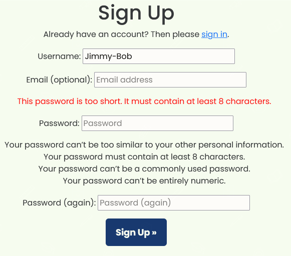
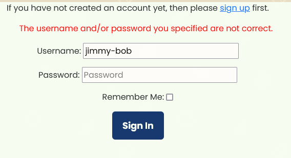
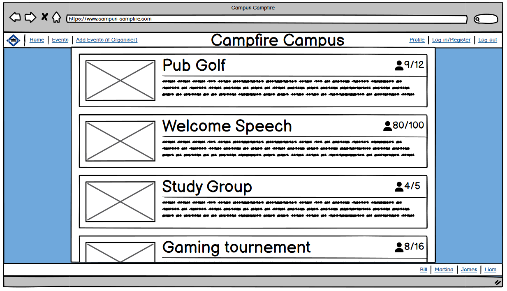

<h1>CAMPFIRE CAMPUS README.MD</h1>

<h2>Introduction</h2>

Campus Campfire is site site for college students who whan to connect, create events and leave their review on these events. As well students can select if they want to attend to an event and rate it onece it takes place.

## Landing page for first time users

The landing page allows users to see a display with all the upcommimg events ordered in chronologically way, being the closest one, the first appearing on the top of the page.

Besides, right at the top the users can see the logo of the page in bright blue with a navbar under it that contains the main sections of the site: Home, Register and Login. Alonside with the navbar, on the opposte side of the page the user can find the footer with the names of the developers who worked together on this project. 

<strong>Landing page for first time users</strong>

<strong>Home page across multiple devices</strong>

 

## Home page (Site Logo)

The fisrt element that the user sees when visiting site, is the logo: Campfire Campus in big, bright blue font. 

- User experience in the Logo section: 

  - The selection of size, colour and type of font, 
 helps the user to identify quickly the name of the site.

  - The name of the site "Campfire Campus" indicates clearly that this is a website related with the academic world. In addition, the name indicates that it is a place for socialising and students are welcomed. 
  
  - Thanks to the Logo the user would feel comfortable and with a postive attitude even before checking the rest of the page. 

 <strong>Home page Logo section</strong>

  

## Home page (Events) 

The Home page focuses mainly on the display of the events, as we mentioned before the events oppeared ordered in time. Each event is enclosed in a black squeare to differentiate it from the rest of events. The main features that can be highlithed are:

- The name of the event is as well a clickable button for the user. 

- Under the event name, the user can see the location, the date, and the creator of the event each one with a descriptive icon.  

- On the top right corner, the user can see the number of available spots and the number of participants attending with icon next to it. 

- Finally, on the bottom right corner there is a clickable button for those students who want to register.

- User experience in the events section: 

  - The selection of size, colour and type of font, 
 helps the user to identify quickly the name of the event and the button for registring.
 
  - The icons give important visual information about the event (location, date, author, number of participants) and help the user to navigate through the information provided.
  
   - The clickable button is easy  to identify, as it stands alone on the right corner, besides it gives straight and intuitive access to the new user who wants to register for an upcoming event.

<strong>Home page Events section</strong>

## Home page (Navbar and foooter) 

Apart from the events, section the Home page also provides the user with a useful navbar and a informative footer. The navbar is divided into three main areas of interest; Home, Register and Login and the footer proportionate information of interest about the developers that collaborated on this project. The main features that can be highlithed are:

- The clickable sections in both, the navbar and the footer 

- The colour animation when the user hovers over the clickable parts.

- The change in the cursor icon when the user hovers over the clickable parts.

- User experience in the navbar and footer section: 

  - The selection of size, colour and type of font, 
 helps the user to identify quickly the different sections that can be found on the navbar.

  - The colour transition animation in the navbar and the footer, as well as the change in the cursor icon, both give clear indications about the clickable property of the elements in these sections. Besides, they produce an eye-catching effect on the user when these elements are hoovered over, creating the need for clicking and a sense of mistery.

  - The Git hub cat icon in the footer,  gives important visual information about the names, as it makes explict their contribution as developers in the project. 
  

<strong>Home page Events section</strong>

## Authentication

### Registration

We have a registration page built using the default django user registration form, we have a custom view to display messages back to the user to feedback when the form is incorrect but as the default view isn't very customizable it displays mid-form. A fully bespoke solution would be needed next project

  

### login

We have a simple frictionless login page so users can log in quickly, it will feedback to the user if there are errors. a future feature would be password recovery via email

  

## Design Choices

### Fonts 

IntroRust was chosen as a more interesting font that would give character to the page. It was sourced from [here](https://www.fontspring.com/fonts/fontfabric/intro-rust-free?utm_source=fontsquirrel.com&utm_medium=download_link&utm_campaign=intro-rust#firstfreeproduct)

We selected the font style Poppins 'https://fonts.googleapis.com/css2?family=Poppins:wght@300;400;500;600;700;800;900&display=swap'. It's is sans serif, so very clear and easy to read. it's popularity on the web gives it instant recognition as well'

We selected more plain and simple design with professional colours but a big, vibrant pop of pink as an accent. We derived our colours from [coolors](https://coolors.co/012765-d30cd5-003fa5-010100-f8fff4)

  

### Wire Frames

<strong>The wireframes were constructed using Balsamiq in a group call to get feedback on all design choices. This was so front-end and back-end could be aligned even from the early stages to think of any pitfalls that could occur </strong>

You can view the wireframes [here](./ReadmeFiles/Wireframes/CampusCampfire.pdf)

  

### Database

We tried to plan out our models before had to avoid having to do migrations mid-project. we tried to work out the field types, one-to-many, PK or FK etc. 

Here is an image of our ERD:

  

## User Stories, features and bugs

<table>
  <tr>
    <th>User Story</th>
    <th>Features</th>
    <th>Bugs / Issues - tested across viewports of all devices using Google Dev Tools</th>
  </tr>
   <tr>
    <td>As a user, I want a flowing, integrated user experience. </td>
    <td>No bugs or issues that make interaction with site feel awkward</td>
    <td>1. Three second delay between selecting answer and next question  
    2. On large devices the "Enter name" box obscures the brand logo and feels like a pop-up rather than an integrated element of the UX package</td>
   
    
  </tr>
  </table>

 

### User Stories and Features (to be implelemented next Sprint) 

  <table>
  <tr>
    <th>User Story</th>
    <th>Features</th>
    <th>Bugs / Issues</th>
  </tr>

  <tr>
    <td>As a user I want to be able to store my highest score to see if I can beat it on my future visits.</td>
    <td>Highest score from previous use visible (cookies required)</td>
    <td>N/A</td>
  </tr>
  

  </table>

### Won't haves

  <table>
  <tr>
    <th>User Story</th>
    <th>Features</th>
    <th>Bugs / Issues</th>
  </tr>
  <tr>
    <td>As a user, I want to have a countdown timer to challenge myself to answer more quickly.</td>
    <td>A countdown timer to display either how long I have left to answer the question before it assigns to wrong</td>
    <td>N/A</td>
  </tr>

## Fixed Bugs / Issues
 
<table>
  <tr>
    <th>Bug/Issue</th>
    <th>Image</th>
    <th>Resolution</th>
  </tr>
  <tr>
  <td>"Select type" option overflows to below options box on smaller devices</td>
    <td></td>
    
  <td>We added media queries to ensure effective responsiveness</td>
  </tr>
  </table>

## Unfixed Bugs / Issues
<table>
  <tr>
    <th>Bug/Issue</th>
    <th>Image</th>
    <th>Resolution</th>
  </tr>
  <tr>
  <td>On large devices the "Enter name" box obscures the brand logo and feels like a pop-up rather than an integrated element of the UX package</td>
    <td></td>
    
  <td>Unfortunately we ran out of time to fix this. We would in future sprints change from an in-browser alert box to a html modal box, that would be styled and centred on the screen etc as part of a user management system.</td>
  </tr>
</table>

### Validator Testing 

For HTML validation https://validator.w3.org/

For CSS validation  https://jigsaw.w3.org/css-validator/

## Deployment

Site successfully deployed on [heroku](https://campus-campfire-d6ae0237c555.herokuapp.com/)

## Credits 

[Coolors](https://coolors.co/012765-d30cd5-003fa5-010100-f8fff4) was used for colour pallette

[Bootstrap](https://getbootstrap.com/)

[fontawesome](https://fontawesome.com/)

### Content 

For validation in HTML https://validator.w3.org/

For validation in CSS https://jigsaw.w3.org/css-validator/

Wireframes produced using [Balsamiq](https://balsamiq.com/)

