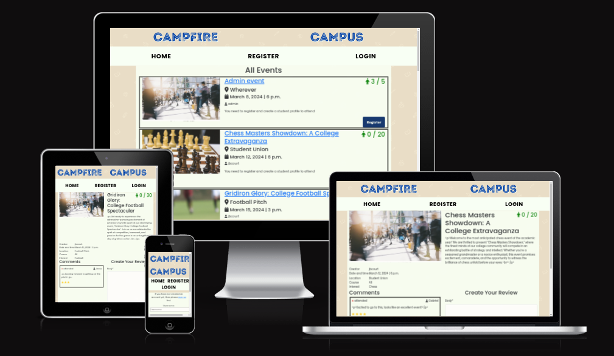

<h1>CAMPFIRE CAMPUS README.MD</h1>

<h2>Introduction</h2>

Campus Campfire is a site allowing college students to connect, create  events and leave their reviews on them. Students are also able to indicate that they will attend an event, and give it a star rating.

The live site is deployed on Heroku [here](https://campus-campfire-d6ae0237c555.herokuapp.com/).

## Site Development
This site was developed using an Agile methodology, with a focus on getting a minimum viable product in place first before adding further features. User stories were sorted using MoSCoW prioritisation, and GitHub projects was used for the project board. An image of this at the end of the project can be seen below.

User experience was considered throughout the development process in order to give a cohesive feel.

## Landing page for first time users

The landing page allows users to see a display with all upcoming events, including details such as how many students are attending. Users are unable to indicate that they will attend an event until they have registered as a student and logged in.

Users can see the site logo at the top of the page in bright blue with a navbar under it that contains the main sections of the site: Home, Register and Login. At the bottom of the page the user can find the footer with the names of the developers who worked together on this project. 

<strong>Landing page for first time users</strong>

## Home page (Site Logo)

The first element that the user sees when visiting site, is the logo: Campfire Campus in big, bright blue font. 

- User experience in the Logo section: 

  - The selection of size, colour and type of font, 
 helps the user to identify quickly the name of the site.

  - The name of the site "Campfire Campus" indicates clearly that this is a website related with the academic world. In addition, the name indicates that it is a place for socialising and students are welcomed. 
  
  - Thanks to the Logo the user would feel comfortable and with a positive attitude even before checking the rest of the page. 

 <strong>Home page Logo section</strong>

  

## Home page (Events) 

The Home page focuses mainly on the display of the events, as mentioned above. Each event is enclosed in a black square to differentiate it from the rest of events. The main features that can be highlighted are:

- The name of the event is as well a clickable button for the user. 

- Under the event name, the user can see the location, the date, and the creator of the event each one with a descriptive icon.  

- On the top right corner, the user can see the number of available spots and the number of participants attending with icon next to it. 

- Finally, on the bottom right corner there is a clickable button for those students who want to indicate that they will attend.
  - This button displays as "Register" for non-authenticated users, alongside a prompt explaining that they must register & create a student profile in order to attend. Clicking the button will direct them to the registration page.

- User experience in the events section: 

  - The selection of size, colour and type of font, 
 helps the user to identify quickly the name of the event and the button for registering.
 
  - The icons give important visual information about the event (location, date, author, number of participants) and help the user to navigate through the information provided.

  - The colour of the attending icon helps it stand out on the page.
  
  - The clickable button is easy  to identify, as it stands alone on the right corner, besides it gives straight and intuitive access to the new user who wants to register for an upcoming event. It also grows and changes the cursor when hovered over to add to this.

<strong>Home page Events section</strong>

## Home page (Navbar and foooter) 

Apart from the events section the Home page also provides the user with a useful navbar and an informative footer. The navbar is divided into three main areas of interest: Home, Register and Login and the footer proportionate information of interest about the developers that collaborated on this project. Once the user is logged in the navbar links change to Home, My Events, Profile and Logout. The main features that can be highlighted are:

- The clickable sections in both, the navbar and the footer 

- The colour animation when the user hovers over the clickable parts.

- The change in the cursor icon when the user hovers over the clickable parts.

- User experience in the navbar and footer section: 

  - The selection of size, colour and type of font, 
 helps the user to identify quickly the different sections that can be found on the navbar.

  - The colour transition animation in the navbar and the footer, as well as the change in the cursor icon, both give clear indications about the clickable property of the elements in these sections. Besides, they produce an eye-catching effect on the user when these elements are hovered over, creating the need for clicking and a sense of mystery.

  - The Git hub cat icon in the footer,  gives important visual information about the names, as it makes explicit their contribution as developers in the project. 
  

<strong>Navbar: new user</strong>

<strong>Navbar: logged in</strong>

<strong>Footer</strong>

## Authentication

The allauth package was used to implement authentication for this site, and the templates adapted to fit the site theme. Users are able to sign up (register), log in and log out.

### Sign up

  

### Log in

  

### Log out

  

## Design Choices

### Fonts 

IntroRust was chosen as a more interesting font that would give character to the page. It was sourced from [here](https://www.fontspring.com/fonts/fontfabric/intro-rust-free?utm_source=fontsquirrel.com&utm_medium=download_link&utm_campaign=intro-rust#firstfreeproduct)

We selected the font style [Poppins](https://fonts.google.com/specimen/Poppins). It's a sans serif font, so very clear and easy to read. Its popularity on the web gives it instant recognition as well.

We selected more plain and simple design with professional colours but a big, vibrant pop of pink as an accent. We derived our colours from [coolors](https://coolors.co/012765-d30cd5-003fa5-010100-f8fff4)

  

### Wire Frames

The wireframes were constructed using Balsamiq in a group call to get feedback on all design choices. This was so front-end and back-end could be aligned even from the early stages to think of any pitfalls that could occur 

You can view the wireframes [here](./ReadmeFiles/Wireframes/CampusCampfire.pdf)

  

### Database

We planned our models beforehand to avoid having to do migrations mid-project. We established the field types, one-to-many, PK or FK etc. 

Here is an image of our ERD:

  

## User Stories, features and bugs

<table>
  <tr>
    <th>User Story</th>
    <th>Features</th>
    <th>Bugs / Issues - tested across viewports of all devices using Google Dev Tools</th>
  </tr>
   <tr>
    <td>As a user I want to know the name of the website so that I can share it with people. </td>
    <td>Title of the app displayed on the header with an attractive font style.</td>
    <td>None detected</td>
   
    
  </tr>
  <tr>
    <td>As a user I want to be able to create an account so I can have my own user profile.</td>
    <td>Create own account. Log into profile.</td>
    <td>None detected</td>
  
  </tr>
   <tr>
    <td>As a student I can join events so that I can foster growth in my interests or studies</td>
    <td>Events page with all events displayed. Organisers know who is attending.</td>
    <td>On event detail page attending button can't see student status. To be fixed next sprint.</td>
  <tr>
    <td>As a user I can update my profile so that other users can learn more about me and I see more related content</td>
    <td>Display name. Display bio.</td>
    <td>None detected. </td>
  </tr>
  <tr>
    <td>As a site owner I can collect feedback on events so that I can see which events are successful and popular and which arent.</td>
    <td>Rate events. Comments system by attendees.</td>
    <td>None detected.</td>
    
  </tr>
  <tr>
    <td>As an organiser I can create events so that students can attend them.</td>
    <td>Specify date, time, location, course or interest, and max. participants. Add an event picture.</td>
    <td>None detected.</td>
    
  </tr>
  <tr>
    <td>As a user, I want the site to be easily navigable.</td>
    <td>Different features of site are clearly identifiable</td>
    <td>None detected</td>
    
  </tr>
  <tr>
    <td>As a reviewer, I want to be able to choose the star rating from a pre-populated list.</td>
    <td>Star ratings selectable from 1-5 stars.</td>
    <td>None detected</td>
    
  </tr>
  <tr>
    <td>As a user, I want the site to be visually appealing.</td>
    <td> Select complementary colour scheme.  
    Different elements/features delineated.</td>
    <td>None detected</td>
    
  </tr>
  </table>

 

### User Stories and Features (to be implelemented next Sprint) 

  <table>
  <tr>
    <th>User Story</th>
    <th>Features</th>
  </tr>

  <tr>
    <td>As a student I want to able to search filter events so that I can attend events of my interest.</td>
    <td>Filter by category, words or interests.</td>
  </tr>
  
  <tr>
    <td>As a Student I can get notified of upcoming events so that I am less likely to miss or forget the event.</td>
    <td>Get notifications from upcoming events.</td>
  </tr>
  
  <tr>
    <td>As a user I can receive confirmation of successful create, update and delete operations so that I can have a more positive user experience</td>
    <td>Implement messages to confirm user actions</td>
  </tr>

  <tr>
    <td>
      As an organiser I can see which students are going to attend the events that I have created so that I can improve my event offering.
    </td>
    <td>
      List of attendees visible on event detail page, but hidden from all but authenticated event organiser.
    </td>
  </tr>

  </table>

### Won't haves

  <table>
  <tr>
    <th>User Story</th>
    <th>Features</th>
  </tr>
  <tr>
    <td>As a user I want to be able to follow other students.</td>
    <td>Follow option.</td>
  </tr>
  </table>

### Fixed Bugs
<table>
  <tr>
    <th>Bug</th>
    <th>Description</th>
    <th>Resolution</th>
  </tr>
  <tr>
  <td>User upload of images</td>
  <td>Images uploaded through the site profile or event creation pages were not being added to cloudinary and so weren't being reflected in the database or created profile/event.</td>
  <td>This was an issue with the setup of the cloudinary upload field. A workaround was found employing the cloudinary upload widget to upload the image and then using JavaScript to populate the image URL for display in the created profile/event. This will be improved in the next sprint to bring the image upload into the form itself, since the solution to the bug has now been found.</td>
  </tr>
</table>

## Unfixed Bugs

These will also be fixed in the next sprint.

<table>
  <tr>
    <th>Bug/Issue</th>
    <th>Description</th>
    <th>Resolution</th>
  </tr>
  <tr>
  <td>"Attend" button for events does not change to reflect that a user is attending an event.</td>
  <td>The "Attend" button for each event on the home page should change to reflect that a signed-in user is attending.</td>
    
  <td>As with the image upload bug, the fix for this has been found on a subsequent project and will be implemented in the next sprint. It can be achieved using JavaScript.</td>
  </tr>
</table>

### Validator Testing 

#### HTML
The [w3 validator](https://validator.w3.org/) was used to validate all pages. All passed with no errors other than those introduced by external packages:
  - crispy-forms in its rendering of textarea elements, which are outside of developer control. 
  - allauth: the signup page showed errors related to the html used to display the registration form, again outside of developer control.

#### CSS
The [W3C validator](https://jigsaw.w3.org/css-validator/) was used to validate the CSS written for the site. All of the developer-generated CSS passed with no errors, with the exception of some pseudo-classes used to generate hover effects on navbar items and buttons. However these work as intended and do not cause any issues.

#### JavaScript
The JavaScript written for this website was passed through [jshint](https://jshint.com/) and found to contain no errors, with only advisory warnings about syntax available in ES6 being displayed.

### Responsiveness

The site was tested for responsiveness across a range of screen sizes, and was found to adjust to the different screen sizes well. The below screenshot from [amiresponsive](https://ui.dev/amiresponsive) shows this.

#### Individual Pages
The responsiveness of the site's individual pages is shown below.
<strong> Home </strong>

<strong> My Events </strong>

<strong> Profile </strong>

<strong> New Student Form </strong>

<strong> Signup </strong>

<strong> Login </strong>

<strong> Logout </strong>

## Deployment

Site successfully deployed on [heroku](https://campus-campfire-d6ae0237c555.herokuapp.com/)

## Technologies Used
This site involved the use of the following technologies & frameworks:
- HTML
- CSS
  - Bootstrap 5
- JavaScript
- Python
- Django 4
  - Package allauth for authorisation
  - Package crispy for form display
  - Package allauth for authorisation
  - Package summernote for admin page model display
  - Package whitenoise for handling static files
- Cloudinary for image storage
- ElephantSQL for database hosting
- Heroku for deployment
- GitHub for version control
- GitHub Projects for project management
- LucidChart to produce the database diagram
- Balsamiq for wireframing

### Other Credits 

Other useful tools were [Coolors](https://coolors.co/012765-d30cd5-003fa5-010100-f8fff4) for colour palette selection and [fontawesome](https://fontawesome.com/) for icons.

## Development Team
This site was developed as part of a hackathon within the Code Institute's Full Stack Development Bootcamp. 
The team lead was [Bill](https://github.com/bvelizmera), working with [James](https://github.com/alphabetjim), [Liam](https://github.com/caleom) and [Martina](https://github.com/martinamicaela).

